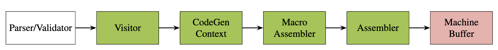

## Verifying Panic Freedom in Winch


Winch is a WebAssembly "baseline" or single-pass compiler designed for Wasmtime. This repository is a [snapshot](https://github.com/bytecodealliance/wasmtime/tree/50307096) from early 2025 that has been modified for verification purposes.


*Architecture diagram: trusted, verified and stubbed components of Winch*

Our primary goal in this branch is to successfully verify the *panic freedom* of core components in Winch. We focus on the x86_64 target in our verification effort.

## Structure
```
├── assets
├── .cargo (configuration for standard libraries)
├── legacy (reference compilations of snapshot)
├── src (winch source code and proofs)
├── verify (script to create docker image)
├── .gitignore
├── .justfile (defines commands for running proofs)
├── Cargo.lock (locks used dependencies)
├── Cargo.toml (defines dependencies, targets and panic style)
├── LICENCE
├── README.md
├── build.rs (target specific builder)
└── rust-toolchain.toml (fixes rust to v1.64)
```

## Dependencies

- [just](https://github.com/casey/just): command runner for running verification jobs
- [LLVM 14](https://github.com/llvm/llvm-project/tree/release/14.x): Compilation target for our verification effort
- [SeaHorn](https://github.com/seahorn/seahorn/tree/dev14): Verification toolchain that has SeaBMC (a bounded model checker for LLVM-IR)

## Proof Collections

There are 14 proofs that are split into four categories that prove panic freedom and encode necessary invariants:
- *visit_setup*: two proofs that cover the Macro Assembler (masm) and Assembler (asm) constructors, as well as the checked_uadd function in the masm.
- *visit_cmp* one proof that covers all comparison operators in the masm, and the functions they invoke.
- *visit_arith* nine proofs that cover core arithmetic operations.
- *visit_funcs*: 2 proofs that cover ABI signature creation and call sequence for locally defined functions with no parameters/returns.

The proof collection names also function as their target name when running the proofs. We use *verify_setup* as the default target in the `.justfile`.

## Run Commands
- `just build visit_setup`:  builds the *visit_setup* target and emits the corresponding LLVM-IR to *target/arch-type/release/deps/visit_setup-hash.ll*
- `just verify visit_setup`:  searches for *target/arch-type/release/deps/visit_setup-hash.ll* and runs it through SeaHorn
- `just prove visit_setup`:  combines the build and verify commands into one
- `just debug visit_setup`:  if SeaHorn finds a counter example, it produces an executable *exec.out* that shows the panic

## Docker

This is the recommended way to get started with the project. We expect it to work on machines that support docker images for x86_64. Our tests were also run on an M3 mac with no issues.

From the top level directory, build the project with:
```
docker build -t winch . --file verify/Dockerfile
```

This will take several minutes, depending on your machine. It builds the project on top of SeaHorn nightly so that all the dependecies are in one place. To run the project, use the command below:
```
docker run -it winch
```

Once in the docker, use the `just` command at the top level directory to get a clean build and the verifier invoked on the `visit_setup` proof colleciton.

## Demo

At the moment, we expect to get unsat for all proof categories since none of the functions have a path that leads to a panic.

Removing any of the invariants in the proofs will result in a panic path. We show this in the demo below:


